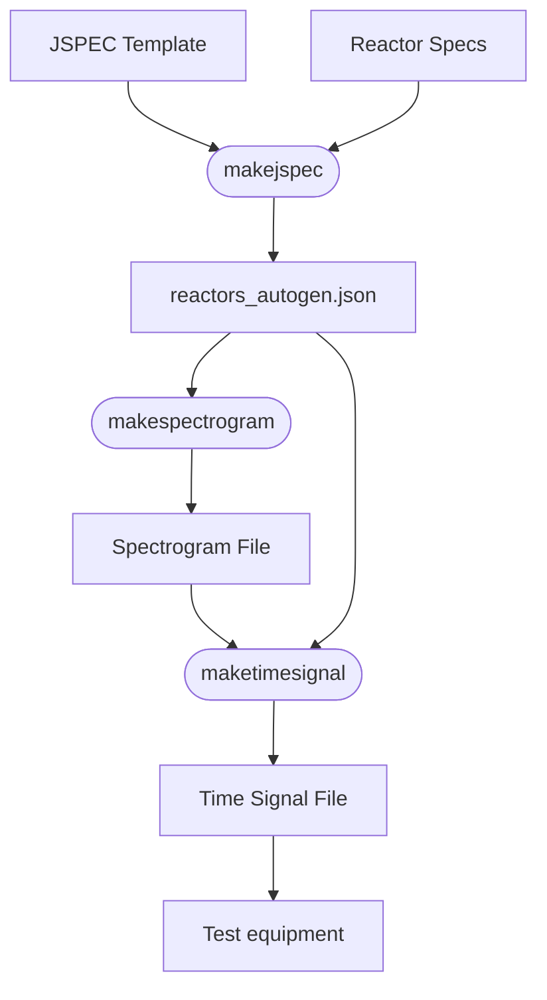

# IEEE P3388 RFI Generation (p3388_general_rfi_tv)
This project contains MATLAB code that may be used for the generation of generic radio frequency interference (RFI) test vectors at any frequency.  These test vectors would be used to replicate of interference in either a simulation or a laboratory test setting using equipment capable of upconverting a baseband signal to a real center frequency.  This code is not meant to replace commercial test equipment, although it code be beneficial to include the concept of this product in commercial equipment in support of the IEEE 3388 wireless test standard.

## How to use this code

### General Workflow
The process for using this code is straightfoward.  It entails developing a J specification (or JSPEC) in JSON which specify properties of reactors used to .  Tools are provided to create this JSON file from information in an Excel spreadsheet.  The process is described in the diagram below.



### What is a JSPEC Reactor?
The notation J is used commonly to denote an interference or jamming signal.  As such, a "Jspec" is simply a specification for interference, and in this case, radio frequency interference.  The Jspec provides information in the JSON format regarding frequency, time, and amplitude characteristics of the interference.  The goal is to produce a perspective over time, frequency, and amplitude of an interference scenario as easily as possible.  A reactor is a state machine construct that allows for the modeling of the ON/OFF behavior of the signal using a Gilbert-Elliot probability model.  The user must provide the desired transition probabilities.  Time, amplitude, and freqency properties allow the user to create scenarios to be applied.

### Creating a JSPEC
A Jspec is created with two components, 1) a Jspec header template, and 2) a Jspec reactor specification file.

To produce a Jspec autogenerated file, in MATLAB call the following command.
```
makejspec
```

### Creating a Spectrogram Reactor Specification
A Jspec reactor specification file is a spreadsheet with the following information.  Each reactor is specified as a row with the columns specifying the properties of each.  The properties for a Jspec reactor are as follows:

+ Name
+ type
+ centerbin
+ ge_prob_11
+ ge_prob_12
+ ge_prob_21
+ ge_prob_22
+ bw_distr_type
+ bw_distr_mean
+ bw_distr_std
+ pwr_distr_type
+ pwr_distr_mean
+ pwr_distr_std
+ pwr_shaping
+ pwr_shaping_std


### Converting the Spectrogram to a Time Signal

### View resulting files

### Playback

## The IEEE 3388 Standard
The IEEE 3388 Standard, titled "Standard for the Performance Assessment of Industrial Wireless Systems," is used to establish a framework for evaluating the performance of wireless networks in industrial and mission-critical settings where reliability and latency are critical. It is protocol-agnostic, meaning it applies to all wireless protocols used in industrial environments, such as manufacturing, power generation, precision sensing, and closed-loop control systems.

The standard serves the following key purposes:

+ Defines a Functional Model: It provides a model for radio frequency (RF) performance degradation factors, known as "aggressors" (e.g., interference, competing traffic, and multi-path propagation), that impact wireless signal quality.
+ Reference Test Architecture: It outlines a standardized test methodology and architecture for assessing the performance of industrial wireless systems.
+ Transparent Assessment Process: It specifies processes for test planning, evaluation, and reporting to ensure transparency and consistency.
+ Industry-Specific Profiles: It includes instructions for creating tailored profiles to customize the assessment process for specific industries, applications, or scenarios.
+ Enhances Reliability: By enabling standardized testing prior to deployment, it helps ensure wireless systems are reliable for mission-critical applications, such as those involving sensors, actuators, and control systems.

The 3388 standard does not cover hardware implementation details, signal processing algorithms, or the internal workings of the wireless networks being tested. It aims to advance the adoption of wireless technology as a reliable communication mode in industrial environments by addressing both physical and electromagnetic forms of signal degradation.

+ The standard may be found here at the IEEE P3388 landing page [here](https://standards.ieee.org/ieee/3388/11516/). 
+ Information on the working group may be found [here](https://sagroups.ieee.org/p3388/)


