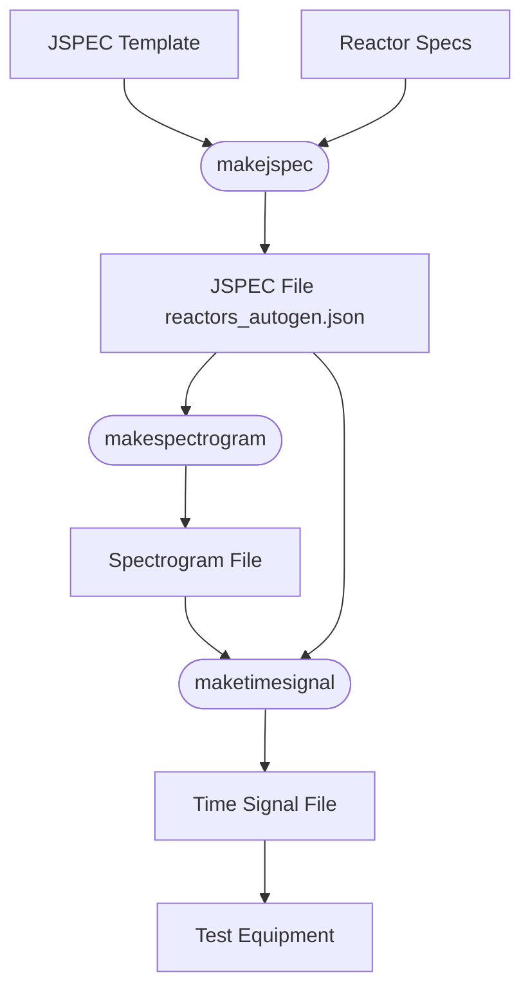

# RFI Generation for IEEE 3388 Wireless Test Standard

This MATLAB project, named `p3388_general_rfi_tv`, provides tools to generate generic radio frequency interference (RFI) test vectors. These test vectors are essential for simulating or replicating interference in controlled environments, such as laboratories or simulations, where equipment can upconvert baseband signals to the desired center frequency. The project is designed to support the [IEEE 3388 standard](https://standards.ieee.org/ieee/3388/11516/), which focuses on assessing the performance of industrial wireless systems under various RF degradation factors, including interference.

Although not a substitute for commercial test equipment, this code is intended to complement such systems and facilitate standardized testing as per IEEE 3388.

## Table of Contents

- [How to Use This Code](#how-to-use-this-code)
- [Understanding JSPEC and Reactors](#understanding-jspec-and-reactors)
- [Creating a JSPEC File](#creating-a-jspec-file)
- [Creating a JSPEC Reactor Specification](#creating-a-jspec-reactor-specification)
- [Generating the Spectrogram](#generating-the-spectrogram)
- [Converting Spectrogram to Time Signal](#converting-spectrogram-to-time-signal)
- [Viewing the Results](#viewing-the-results)
- [About the IEEE 3388 Standard](#about-the-ieee-3388-standard)

## How to Use This Code

The code follows a straightforward process to generate RFI test vectors. It starts with creating a JSON-based J specification (JSPEC) that defines interference characteristics. Tools are provided to generate this JSON file from an Excel spreadsheet. The workflow is illustrated below:



## Understanding JSPEC and Reactors

### What is a JSPEC?

A **JSPEC** (Jamming Specification) is a JSON-formatted file that defines the frequency, time, and amplitude characteristics of RF interference, often referred to as "J" for jamming. It allows users to model complex interference scenarios efficiently.

### What is a Reactor?

A **reactor** is a state machine that models the ON/OFF behavior of the interference signal. It uses a Gilbert-Elliot probability model, where users can specify transition probabilities between ON and OFF states.

## Creating a JSPEC File

A JSPEC file is generated from a combination of the JSPEC header template and the JSPEC reactor specification, which is provided in an Excel spreadsheet.

1. **Prepare the JSPEC Reactor Specification**: Create an Excel spreadsheet with the required parameters for each reactor (detailed in the next section).
2. **Generate the JSPEC File**: Run the following MATLAB command to generate the `reactors_autogen.json` file:

   ```matlab
   makejspec
   ```

   This command reads the spreadsheet and combines it with the header template to create the complete JSPEC file.

## Creating a JSPEC Reactor Specification

A JSPEC reactor specification file is a spreadsheet where each row represents a reactor, and the columns specify the properties of each reactor. The properties for a JSPEC reactor are as follows:

| Parameter           | Description                                                                 |
|---------------------|-----------------------------------------------------------------------------|
| **Name**            | Reactor name (not unique).                                                 |
| **type**            | Unused.                                                                    |
| **centerbin**       | Centroid frequency bin (in two-side FFT).                                  |
| **ge_prob_11**      | Probability: OFF → OFF transition.                                         |
| **ge_prob_12**      | Probability: OFF → ON transition.                                          |
| **ge_prob_21**      | Probability: ON → OFF transition.                                          |
| **ge_prob_22**      | Probability: ON → ON transition.                                           |
| **bw_distr_type**   | Bin count distribution type ("normal" or "flat").                          |
| **bw_distr_mean**   | Average bins occupied (relative to center bin).                            |
| **bw_distr_std**    | Standard deviation of bins occupied (relative to center bin).              |
| **pwr_distr_type**  | Interference power distribution ("normal" only).                           |
| **pwr_distr_mean**  | Average interference power.                                                |
| **pwr_distr_std**   | Interference power standard deviation.                                     |
| **pwr_shaping**     | Power shaping (0 = no, 1 = yes).                                           |
| **pwr_shaping_std** | Std. deviation for shaped power (if `pwr_shaping` = 1).                    |

## Generating the Spectrogram

The RFI scenario is represented as a time-frequency-amplitude profile, with interference defined in discrete time intervals. The JSPEC template includes spectrogram parameters that can be modified either in the template or in the generated `reactors_autogen.json` file.

Key spectrogram parameters include:

```json
"spectrogram": {
  "Duration_s": 1,                                         
  "NFreqBins": 1025,                                       
  "WindowSize_s": 0.001,                                   
  "NoiseFloorPower_dB": -100,                              
  "PathToOutputSpectrogram": "./outputs/spectrogram.csv"   
}
```

where the parameters in the JSON snippet are defined as follows:

| Parameter           | Description                                                                 |
|---------------------|-----------------------------------------------------------------------------|
| **Duration_s**            | duration in seconds of the scenario to be produced                    |
| **NFreqBins**            | Number of bins in the two-sided FFT                                    |
| **WindowSize_s**       | Windows duration in seconds of each spectrogram entry                    |
| **NoiseFloorPower_dB**      | power of the noise floor relative to 0 dB                           |
| **PathToOutputSpectrogram**      | output file location for the spectrogram                       |


To generate the spectrogram scenario, run the following MATLAB command:

```matlab
makespectrogram
```

This will create a spectrogram file in CSV format in the specified output directory.

## Converting Spectrogram to Time Signal

The spectrogram can be converted to a time-domain signal using an Inverse FFT (IFFT) process. The IFFT parameters are defined in the JSPEC as follows:

```json
"ifft": {
  "DurationPerChunk_s": -1,
  "StartingSampleRate_Hz": 10e6,
"UpsampleRate": 1,
  "Expansion" : {
      "ExpansionMethod": "upsample",
      "UpsampleInterpolationMethod": "makima"},
  "Phase" : {
      "Enabled": true,
      "ApplyRandomPhaseOffset": 0,
      "PhaseNoise_rads": 6.28 },
  "Plots" : {
      "InFnREP" : 0,
      "InFnIFFT" : 0
  },
  "PathToOutputTimeSignal": "./outputs/timesignal.csv"
}
```

where the parameters in the JSON snippet are defined as follows:

| Parameter           | Description                                                                 |
|---------------------|-----------------------------------------------------------------------------|
|  **DurationPerChunk_s** | duration per time window. A negative value indicates using the original window size of the FFT |
|  **StartingSampleRate_Hz** | the desired baseband sample rate |
|  **UpsampleRate**  | if desired, an upsample rate. This is usually not required |
|  **Expansion**  |  if bandwidth expansio is used, provides parameters for methods |
|    **Enabled** | true for ON (1), false (0) for OFF  |
|    **ExpansionMethod** | options include: "upsample", "repeat", and "interpolation"  |
|    **UpsampleInterpolationMethod** | For upsampling interpolation, the interpolation method described in interp1 of MATLAB.  |
|  **ApplyRandomPhaseOffset**                            | boolean if a block phase offset should be applied |
|  **PhaseNoise_rads**                                   | phase noise applied |
|  **PathToOutputTimeSignal**                            | output file location for the time domain signal |


To generate the time-domain signal, run:

```matlab
maketimesignal
```

The output is a text file containing complex values (real part in the first column, imaginary part in the second). Note that the file size may be large, depending on the sample rate.

## Viewing the Results

The project provides MATLAB scripts to view the intermediary and final outputs:

- `testshowspectrogram`: Displays the generated spectrogram.
- `testshowtimesignal`: Displays the time-domain signal.
- `testjsondecode`: Decodes and views the JSPEC JSON file.

These tools are designed to be user-friendly and help in understanding the generated data.

## About the IEEE 3388 Standard

The [IEEE 3388 Standard](https://standards.ieee.org/ieee/3388/11516/), titled "Standard for the Performance Assessment of Industrial Wireless Systems," offers a comprehensive framework for evaluating wireless network performance in industrial and mission-critical environments. It emphasizes reliability and low latency, which are crucial in sectors like manufacturing, power generation, precision sensing, and closed-loop control. As of February 2025, the standard has been approved and is listed as an active standard.

### Key Features of IEEE 3388

- **Functional Model**: Identifies RF performance degradation factors such as interference, competing traffic, and multi-path propagation.
- **Reference Test Architecture**: Provides a standardized methodology and architecture for performance testing.
- **Transparent Assessment**: Ensures consistency and transparency in test planning, evaluation, and reporting.
- **Industry-Specific Profiles**: Offers guidance for tailoring assessments to specific industries or applications.
- **Enhanced Reliability**: Supports pre-deployment testing to ensure reliable wireless systems for mission-critical applications.

### Scope

The standard focuses on physical and electromagnetic signal degradation but does not cover hardware implementation, signal processing algorithms, or internal network mechanics. Its primary goal is to promote the adoption of wireless technology in industrial environments by addressing reliability challenges.

### Resources

- **IEEE 3388 Standard**: [IEEE 3388 Landing Page](https://standards.ieee.org/ieee/3388/11516/)
- **Working Group Information**: [IEEE P3388 Working Group](https://sagroups.ieee.org/p3388/)

## Notes on Usage

- **Prerequisites**: Ensure MATLAB is installed and properly configured to run the provided scripts.
- **File Handling**: The generated files (e.g., spectrogram and time signal) may be large. Use MATLAB or compatible tools for viewing and processing.
- **Customization**: Modify the JSPEC template or reactor specifications as needed to tailor the interference scenarios for specific testing requirements.
